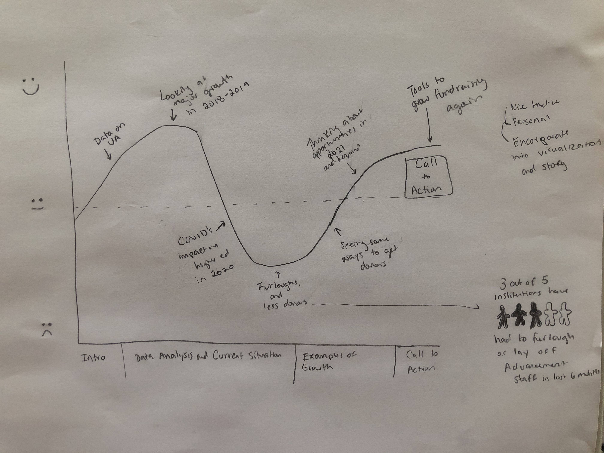

# Final Project Part II

## Storyboards

As I created my storyboards, I focused on the path of the story arch that I had created for Part 1 of the project process. 

 
 
Shown in the graph is the general direction of my story as I shifted my focus to looking at the past, present, and future of higher education fundraising as it is faced with hurdling the COVID-19 pandemic. 

The main visualizations will be important to showcase the majoy growth fundraising had in 2019, the effects COVID-19 had in 2020 including furloughs and loss of donors, some successes that happened as higher education institutions pivoted their efforts, and finally tools and trends that look to be sticking around post-pandemic. My goal is to keep the mood hopeful throughout. Using green felt appropriate as we talk about money, as well as using accents of orange to balance it out. 

To view Moodboard and Storyboard on separate platform: https://www.canva.com/design/DAEYaSRrAQw/view

  <iframe style="position: absolute; width: 100%; height: 100%; top: 0; left: 0; border: none; padding: 0;margin: 0;"
    src="https:&#x2F;&#x2F;www.canva.com&#x2F;design&#x2F;DAEYaSRrAQw&#x2F;view?embed">
  </iframe>

<a href="https:&#x2F;&#x2F;www.canva.com&#x2F;design&#x2F;DAEYaSRrAQw&#x2F;view?utm_content=DAEYaSRrAQw&amp;utm_campaign=designshare&amp;utm_medium=embeds&amp;utm_source=link" target="_blank" rel="noopener">The Past, Present, and Future of Higher Education Fundraisinge</a> by Amber Flevaris

The data I found supported my initial proposal that higher ed fundraising across the country was growing at an exponenital pace. Donors felt engaged with universities through communications, events, and direct relationships with university staff and students. I wanted this graph to be reflective of the excitement that was building, leading into 2020. 

As we get into 2020, the story becomes much more personal and upsetting. The industry was disrupted by a global event, leaving every institution without guidance on how to move forward with asking for gifts when the market was crashing and people were losing their jobs, including university staff. The mood for this section needs to be much more serious than the excitement from the visualizations about growth in the beginning and the innovation to come in the future section.

Universities began to get a hang of the virtual world and fundraising in a pandemic, with some universities actually having better fundraising years than ever before. Donors realized that personal connection when it came to supporting student aid support funds, world events inspiring more support to diversity equity and includion efforts, and resonating with the idea of supporting scholarships and fellowships to keep students learning in their (often times virtual) classrooms and labs. 

As university leaders look ahead to the future, they will need to be mindful of the upcoming trends in the industry. A lot of what was innovated for use during COVID-19 will still continue into the future, including virtual programming and engagement. I wanted to showcase the top trends in a visually pleasing format: being comfortable adapting to a hybrid world, expanding "high-end" digital engagement, and focusing on showcasing the impact of giving. 

## User Research

### Target Audience
The target audience for this story falls into a few categories: 
* University advancement leadership at universities in the United States whose goal is to learn new insights about ways to fundraise right now and into the future 
* Alumni and donors to universities with interest in the topic related to making their gifts and choosing which organizations to support 
* Students of universities who are interested in what institutions are doing as it relates to endowments and their tuition/future with the university 

Each of these different groups, who may be interested in the data, will also have different needs. It’s important for my users to represent each of these groups in some way. I want it to be accessible for someone very knowledgeable about the subject matter, like a staff member, as well as for those who may be invested in the subject but not as familiar with terms and trends (student or donor/alumni). 

### Identifying Users
JR 
 * CMU undergraduate alum and donor, male, age 25 
 * Contact method – In-person
 * As a donor, JR has limited knowledge, but full investment into how the university is doing and where fellow donors are giving. His perspectives are important to see how the average donor/alumni would interpret the story. 

YZ  
 * CMU university advancement leadership staff member and graduate alum, female, age 35  
 * Contact method – Via Zoom 
 * YZ would directly benefit from learning more about the data at other institutions and how the industry is trending. These visualizations could help her make a case for a shift in priorities for her programs at the university. It’s important that someone like YZ be able to understand the visualizations and story, as she has direct knowledge to university advancement. 

JI 
 * CMU undergraduate junior, female, age 20 
 * Contact method – Via Zoom 
* JI is very engaged as a student at the university, but is not familiar at all with how fundraising works. It will be important for a student with no knowledge of university advancement, but an interest in how the university can improve, can understand the story. 

### Interview Script
Introduction:
Thank you very much for sitting down with me today. 
Could you please state your age, job title/major, and affiliation with the university? 
I am going to give you a very short overview of the project I am asking for feedback on. I am in a class called “Telling Stories with Data” where we have been tasked to do just that – tell a compelling story by using data visualizations. 
Would you take the next minute to look over these data visualizations? As you are looking through, please write down any questions that come to mind. Once the time is up, I will address any questions you have and ask a few myself. Feel free to be open and honest with me! The goal of this is to improve my final project, which I can’t do without great constructive feedback. 

Initial questions: 
What are the initial questions or comments you had when first looking through these storyboards? 

Additional questions: 

| Goals    | Questions              |
|--------- | -----------------------|
| Clarity of story | What is the topic of these visualizations? What would you say the tone conveys? | 
| Determining audience | Who do you think is the intended audience of this visualization? | 
| Appropriate messaging | Do you understand what message these visualizations are conveying?|  
| Proper understanding of story | Could you explain to someone else what you’re seeing? |
| Readability of visualizations | What do you like about these visualizations? Is there anything confusing? If so, why do you feel that way?  |
| Make appropriate updates and adjustments | What, if any, issues do you think need to be addressed?  Why do you feel that way? |
| Other metrics, such as excitement, engagement, etc. | Any additional thoughts, comments, or questions?  |

Thank you so much for your time. I look forward to sharing the final product with you! 

### Findings 
After drafting out the script and coming up with multiple questions, I felt that asking 10 questions of each person felt excessive and time-consuming, so I decided to limit to three to five questions per person based on the categories of *clarity of story*, *readability*, and *issues that need to be addressed*. The most difficult task would be to get these individuals to explain *why* they feel a certain way about their feedback. Sometimes it's preference, but other times it's a critical issue with the visualization that I may not have noticed. 

My expectation was that each group would have different priorities, but ultimately, they had similar thoughts and goals. When it came to clarity of the story, they felt that they understood the idea of what I was attempting to get across. Their perspectives on story, understanding, and issues were very interesting. 

* JI - "I think you're trying to say things were going great in philanthropy, then the pandemic happened and no industry was unscathed by it. But with pivoting, higher ed was able to adjust and pivot, and some institutions have more to teach than others. I feel like what's missing is what happened to those people that were furloughed. Do they hire them back or do they not need them as staff anymore in this new world? That's my biggest issue. It could be fixed with more text to explain each graph." 
* JR - "I like that all the visualizations are different - you didn't just use a bunch of pie charts or something. I have no issues following what they mean or confusion about what you're trying to say with them. The audience for this is probably other fundraisers? That would be my guess. I don't know if the average person cares about this as much as the people doing the fundraising. A question I have is WHY fundraising was going so well in the beggining. I get the COVID story and the changing direction and then looking to the future. Maybe it doesn't need to be a whole other visualization, just some context as a caption."
* YZ - "This project is very helpful for me to see! I really want to see the final product and look more into the data you pulled. You put the sources but I would also want to look at the articles themselves that you pulled some of this from. Will there be text to accompany these more? Your titles and desciptions all look great. I'm just wondering if people need more context to these then just you verbally telling them. Does that make sense? I like the colors so far, and how these graphs represent the data otherwise."

### Changes to Implement Before Final Project

## References 

