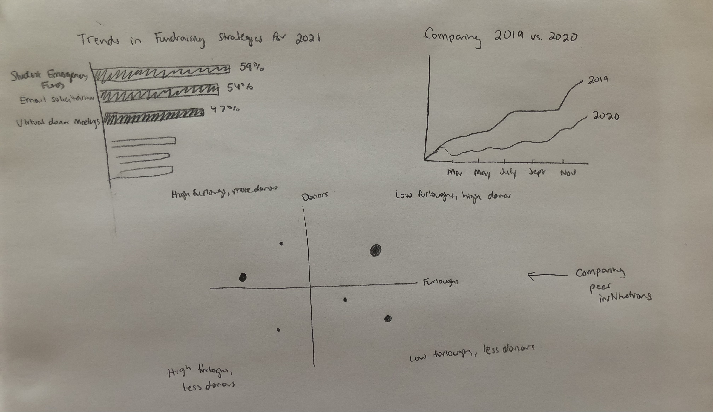

# Final Project - Amber Flevaris

## Outline

The focus of my project will be the impact that the COVID-19 pandemic has had on university fundraising in the United States for 2020 and how to best recover from it in 2021. University fundraising was growing exponentially, until COVID-19 happened and now schools are scrambling to reclaim that growth. As a reader, I want to understand the affect the pandemic has had on university fundraising so that I can make changes to better regrow philanthropy at my institution. My call call to action is that they can do this by understanding trends in the industry such as focusing on student aid funds and university need as fundraising tools. The audience for this story would ideally be leaders in university advancement across the United States, but it's important to remember that the audience for this presentation is fellow classmates with limited knowledge of institutional fundraising. 

Below is an outline of the story:

-Introduction with data on University Advancement

-Data Analysis and Current Situation

---Growth in 2018-2019 for undustry as a whole

---COVID-19's impact on higher education in 2020, including furloughs, loss of donors 

-Examples of Growth 

---CMU's fundraising growth

---Opportunities and trends across the full industry

-Call to Action 

---Tools and trends to grow fundraising at your institution 

## Sketches
 
 
 
 
 
 
## Data

The data will come from a variety of sources, which work directly with universities to survey them and report out on the data that they receive. While some fundraising data is conifdential, organizations such as The Council for Advancement and Support of Education (CASE), The Chronice of Philanthropy, National Conference of State Legislatures (NCSL), and Insider HigherEd publish some of their results. For any interesting topic that I cannot get large datatsets for, I will pull the data directly from the data visualizations that they have put forth in their reporting. These trusted sources in the industry will help me tell the story of the past, present, and future of fundraising in higher education. 

My goal is to use the data to create charts like the above sketches, focusing on fundraising dollar and donor numbers, while also looking at industry trends related to the way these gifts are being achieved. Some trends include encouraging donors to give to student need aid funds and soliciting donors in a virtual way, which will be reflected in the types of visualizations that will be used. A mix of qualitative and quantitative data will give a well-rounded picture of the state of higher education advancement. Based on how interesting the data is based on geography, I would also like to try a mapping visual in Tableau. 

I also have access to datatsets from Carnegie Mellon, which I am able to use with permission from the University Advancement office of what is publicly accessible. 

Below are a few sources I plan to use in my visualizations: 

DATASETS: https://www.insidehighered.com/capital_campaigns, https://www.case.org/resources/voluntary-support-education-survey (Accessible with free account) 

CASE - Voluntary Support of Education for 2018-2019: https://www.case.org/system/files/media/file/VSE%20Research%20Brief%231_1.30.20_WEB.pdf

NCSL - Higher Education Responses to COVID-19: https://www.ncsl.org/research/education/higher-education-responses-to-coronavirus-covid-19.aspx

Inside HigherEd: https://www.insidehighered.com/news/2020/02/06/college-and-university-fundraising-rises-growth-slows-down, https://www.insidehighered.com/news/2020/06/08/survey-forecasts-%E2%80%98dramatic-decline%E2%80%99-fundraising-pandemic

## Method and Medium

For my final project presentation, I will be utilizing Shorthand, which will be the easiest to use and manipulate to create a compelling story. I like the features that allow for scrolling and ease of transitioning to the next section, as well as the helpful tutorials so that creating the final product will not hinder the focus on making great graphs. So far, I had found Tableau and Flourish to be my favorite data visualization tools in the course. I plan to use Tableau for more complex visualizations, including mapping and dot plots with multiple variables. I hope to use Flourish as an additional tool, since I found it so easy to use and create simpler graphs. 

I'll create each visual as they are relevant to each section of the story, starting with the introduction. From there, I'll fill out some text to help explain as the story goes on. Ultimately, I want the visuals to tell the story themselves, but I also understand that this is a topic many of my classmates may not have too much information on. Some may have worked for non-profits in the past, but not all have fundraising or higher education staff backgrounds as I do. Going through all of these visualizations in under two minutes will be challenging, so I need to make sure that I keep the graphs and text succinct and easy to interpret for a broader audience.  

